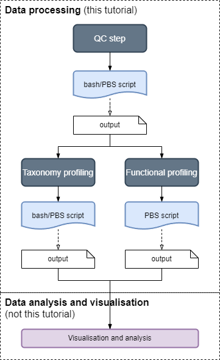

This section shows you how to use the MIMA pipeline for data processing of shotgun metagenomics sequenced reads using the assembly-free approach. 

## MIMA: data-processing

This section covers the data processing pipeline, which consists of three main modules:

<table class="table table-borderless">
<tr>
  <th>Module</th>
  <th></th>
</tr>
<tr>
  <td><b>Quality control</b> (QC) of the sequenced reads</td>
  <td rowspan=4 style="width:40%"></td>
</tr>
<tr><td><b>Taxonomy profiling</b> after QC, for assigning reads to taxon (this step can be run in parallel with step 3)</td></tr>
<tr><td><b>Functional profiling</b> after QC, for assigning reads to genes (this step can be run in parallel with step 2)</td></tr>
</table>

{}
The **Analysis and Visualisation**  comes after the data has been processed and is covered in the [analysis tutorials]()
{}

## How the tutorials works

The tutorials are split into the three modules: 
- [Quality control]()
- [Taxonomy profiling](), and
- [Function profiling]()

Each module has six sub-sections where actions are required in steps 2 to 6.

1. A brief introduction
2. **RUN** command to generate PBS scripts 
3. **Check** the generated PBS scripts
4. **RUN** command to submit PBS scripts as jobs
5. **Check** the expected outputs after PBS job completes
6. **RUN** Post-processing step (optional steps are marked)

{}
## Check list

For this set of tutorials, you need

- Access to High-performance cluster (HPC) with a job scheduling system like OpenPBS
  - HPC system must have `Apptainer` or `Singularity` installed
- [Install MIMA Container image]() 
  - start an interactive PBS job
  - create the image *sandbox*
  - set the `SANDBOX` environment variable
- Take note of the paths for the [reference databases](), namely
  - MiniMap2 host reference genome file
  - Kraken2 and Bracken reference database (same directory for the two tools)
  - HUMAnN reference databases
  - MetaPhlAn reference databases
- Data processing worked on <u>paired-end sequenced reads</u> with two files per sample
  - forward read fastQ files usually has some variation of _R1.fq.gz or _1.fq.gz filename suffix, and
  - reverse read fastQ files usually some variation of _R2.fq.gz or _1.fq.gz filename suffix
- Download [tutorial data]() and check the [manifest file]()

{}