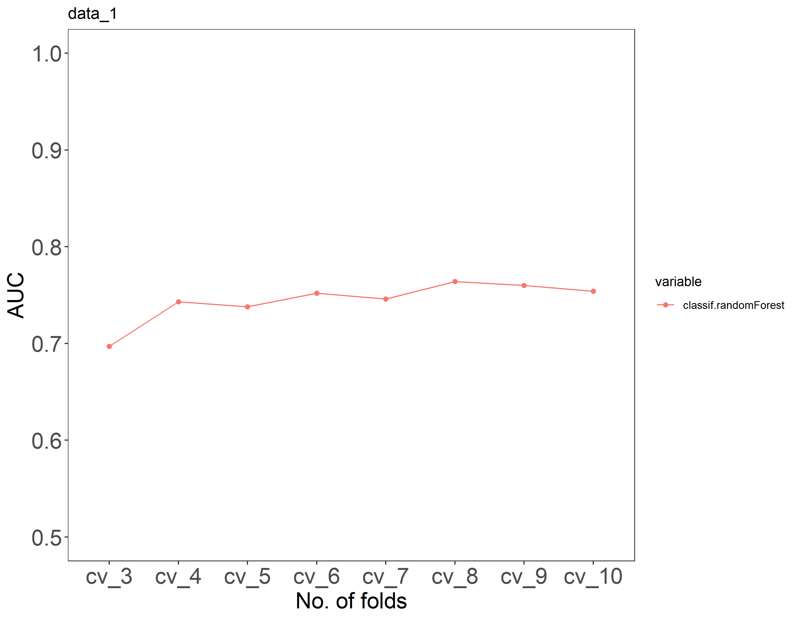
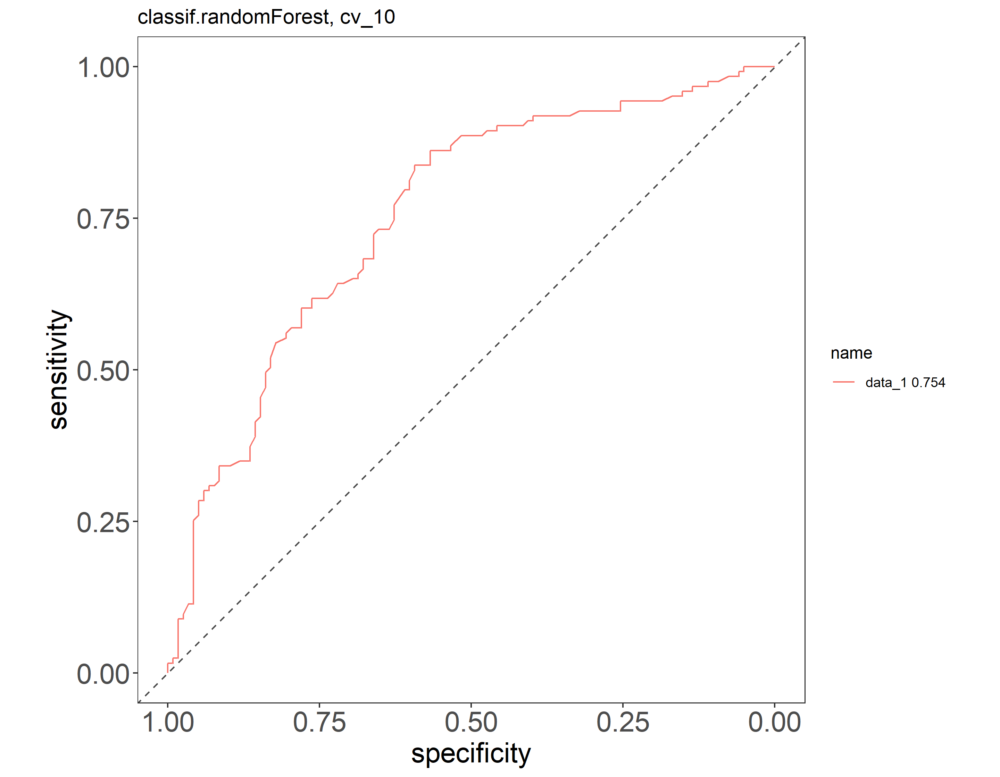
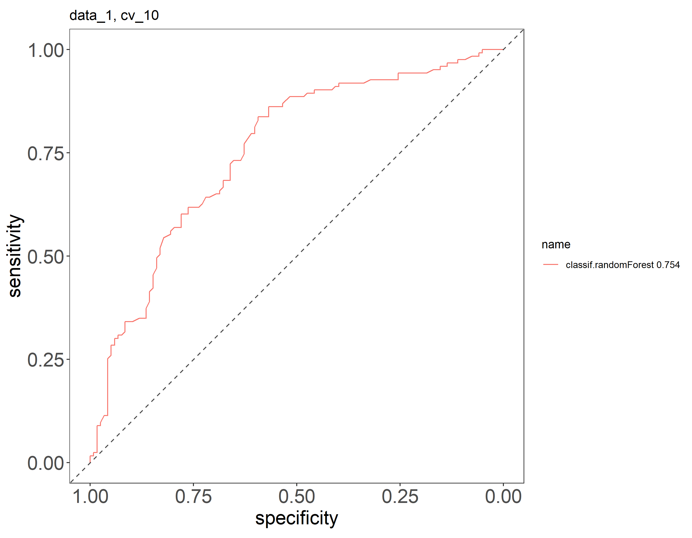
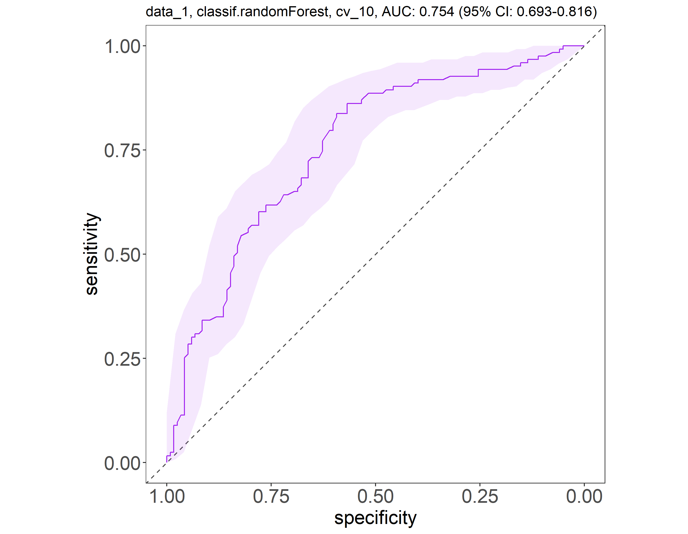

# Classification with Random Forest

This tutorial steps through the classification module using Random Forest.

The module trains a random forest classifier given an input data of feature relative abundances. The input table consists of features (taxa, genes, pathways) as rows and samples as columns. The cells denote the relative abundance of feature $i$ for sample $j$.

Samples belong to mutually exclusive groups defined in the `metadata` and the goal is to classify the samples based on these groups.

...

## Tutorial data

The **mock data** data sets from Tourlousse *et.al.* 2022 which we used in the [data processing without Singularity]({{ site.baseurl }}/docs/tutorials/../../../tutorial-no-singularity#tutorial-data) and [Visualisation] tutorial is very clean and does not make for an interesting classification problem. 

We will use a real data from human stool microbiome, from the Human Microbiome Project V1. The data consists n=241 total samples, of which 118 are from females and 123 are from males. The taxonomy have been annotated using the Metaphlan2 process. We will train the random forest classifier to distinguish between sex.

## Preparation

1. Install the MIMA pipeline
2. Download example data set: [HMPv1-stool-samples.tar.gz](https://github.com/xychua/test-gitpages/raw/master/examples/HMPv1-stool-samples.gz) or use the `wget` command below
3. Extract the files using the following commands

```
$ wget https://github.com/xychua/test-gitpages/raw/master/examples/HMPv1-stool-samples.tar.gz
$ tar -xf HMPv1-stool-samples.tar.gz
$ tree HMPv1-stool-samples
```

- expected output:
```
HMPv1-stool-samples
├── hmp1-stool-visit-1.features.tsv
└── hmp1-stool-visit-1.metadata.tsv
```

----


# Random Forest classifier: Stool-gender HMP

- this time we use the stool samples from the human microbiome project dataset

```
$ conda activate mima
(mima) $ Rscript classifier/random_forest/classifier_pipeline.R \
-i random-forest-example/hmp1-stool-visit-1.features.tsv \
-m random-forest-example/hmp1-stool-visit-1.metadata.tsv \
-c Gender \
-o random-forest-example/hmp1"

$ tree random-forest-example/hmp1/
```

## Output: Stool-gender HMP

- there should be 4 PDF files and 1 log file
- the PDF files are figures which are explained in the table below

```
random-forest-example/hmp1/
├── cv_auc.pdf
├── roc_classif.randomForest_dataset.pdf
├── roc_data_1_classifier.pdf
├── roc_data_1.pdf
└── socket_cluster_log.txt
```

**Output files**

| Output file | Description | Image |
|:------------|:------------|:---------|
| cv_auc.pdf  | plot showing the area under the curve |  |
| roc_classif.randomForest_dataset.pdf | plot showing |  |
| roc_data_1_classifier.pdf | plot showing | |  |
| roc_data_1.png | |  |

